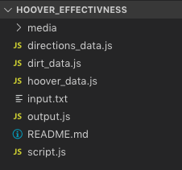
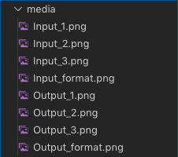

# Description

    A script evaluating the effectiveness of an imaginary hoover cleaning dirt patches using 2D coordinate system.
    To be able to calculate the number of dirt patches cleaned, the user will have to provide room dimensions, 
    hoover starting position, dirt patches' positions and navigating instructions.
    See ##Input Requirements for more info.

# Technologies

    Node.js v10.16.0

# Installation

## Node.js

### MacOs: To install the latest stable version of Node.js run the following command in your terminal: 
    curl "https://nodejs.org/dist/latest/node-${VERSION:-$(wget -qO- https://nodejs.org/dist/latest/ |
     sed -nE 's|.*>node-(.*)\.pkg</a>.*|\1|p')}.pkg" > "$HOME/Downloads/node-latest.pkg" && sudo installer 
     -store -pkg "$HOME/Downloads/node-latest.pkg" -target "/"

### Windows: Visit https://nodejs.org/en/#home-downloadhead and download the latest version. Follow the instructions to install.

## Text Editor
    The easiest way to manipulate the data and run the script is to use a text editor. Choose between:
### Visual Studio Code: https://code.visualstudio.com/
### Atom: https://atom.io/
### Sublime: https://www.sublimetext.com/

# Directory Structure
    This project has one directory containing seven files and one subfolder for media files: 
        1. The import data (input.txt)
        2. The logic split into four files:
            2.1 The unification of the import data (script.js)
            2.2 The directions processing (directions_data.js)
            2.3 Hoover manipulation (hoover_data.js)
            2.4 The dirt patches positioning (dirt_data.js)
            2.5 The evaluation of the combined data and results printing (output.js)
        3. The instructions to run the script (README.md)
        4. The Media folder

    

    

# Input Requirements
    1. The data must be entered in the provided input.txt file. ONLY numbers and letters accepted.
    2. The structure is as follows:
        2.1 The first line of the file determines the dimensions of the room in the format - 
            "X-axis space Y-axis", e.g. "5 5" (you do NOT need to wrap the numbers in " " in the file)
        2.2 The second line is the starting position of the hoover. The format is the same as the format for the first line.
        2.3 Any consecutive lines will allocate positions for the dirt patches. The format is the same as for the previous two lines.
        2.4 The last line is reserved for the navigation instructions using 
            the [Cardinal Directions](https://en.wikipedia.org/wiki/Cardinal_direction), e.g. N, E, S, W.
            The format is as follows: "NNESEESWNWW", **no spaces allowed between the letters** (you do NOT need to wrap the sequence with " " in the file)

    

# Usage
    1. Once you have installed Node.js and the input.txt file has been saved with the required data, 
        you can run `node script.js` your terminal. Ensure the command is run in the project's directory.
    2. The result will be printed out in your terminal:
        2.1 The first line will contain the final position of the hoover in the format - "X-axis space Y-axis", e.g. "1 3"
        2.2 The second line will be the number of dirt patches cleaned represented by a single number, e.g. "1"

    

# Examples
    1.
        1.1 Input
            [Output](/media/Input_1.png)

        1.2 Output
            [Output](/media/Output_1.png)

    2.
        2.1 Input
            [Output](/media/Input_2.png)

        2.2 Output
            [Output](/media/Output_2.png)

    3.
        3.1 Input
            [Output](/media/Input_3.png)

        3.2 Output
            [Output](/media/Output_3.png)

